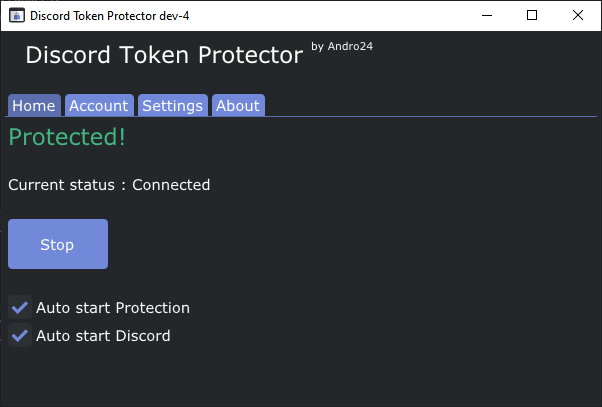
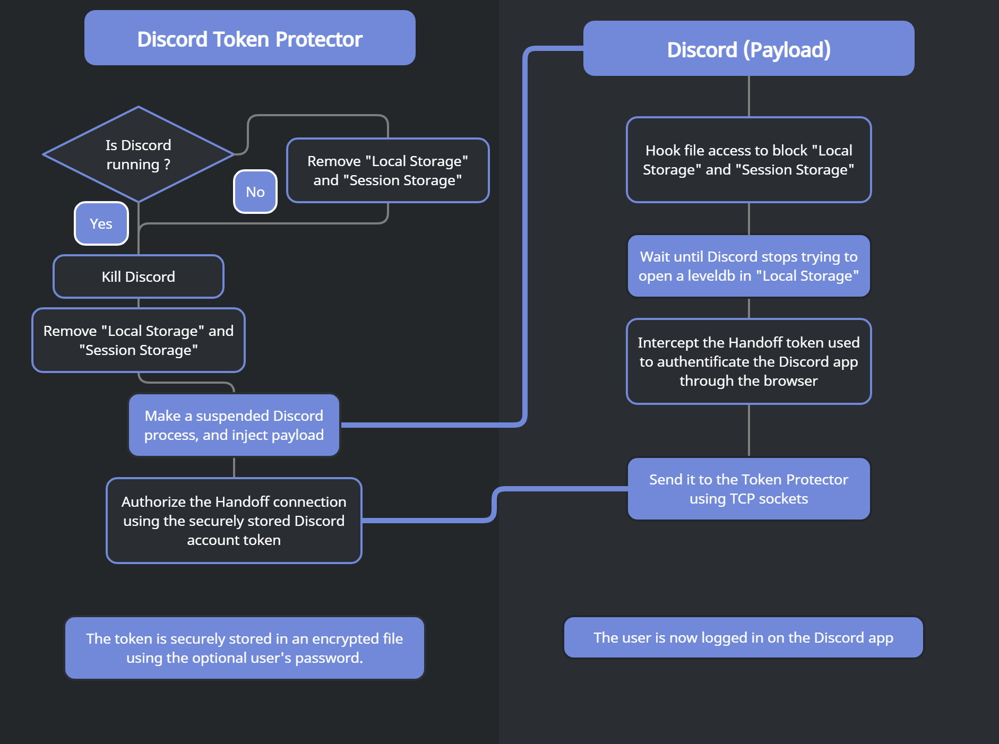

# Discord Token Protector
#### Protect your Discord token from malicious grabbers!

  

This project is still under development! You might face some unstability issues!\
This is in **NO** way a perfect solution against Discord token grabbers.
But this will protect you against most (nearly every) token grabbers.

**Any targeted attack against DiscordTokenProtector can bypass this protection!**

## Installation / Update

### Download the lastest release **[HERE](https://github.com/andro2157/DiscordTokenProtector/releases)**

###### A better installation process will be made. This is temporary.

* Extract the zip file anywhere
* Start the install.bat
* If an existing installation is detected, you can either remove it or update it. Else it will automatically install it in `%appdata%\DiscordTokenProtector`
* You'll need to make a shortcut to `%appdata%\DiscordTokenProtector\DiscordTokenProtector.exe` to start it.

## What does it do?

Here's a little diagram on how it works:

  

It basically removes the `Local Storage` and `Session Storage` directories from `%appdata%\Discord`.
These directories can store your Discord token (used to authentificate you).
Most of the grabbers look for your token there. Therefore, by removing these directories you can avoid getting grabbed.\
Your Discord token is stored in a secure container encrypted with AES-256.

## Some stuff to consider

* By removing these directories, Discord cannot store any local settings.
Meaning that all of your client-specific settings will be removed each time you start Discord. (eg. keybinds, default audio device, ...)\
**BUT**, all of the server-sided settings are still saved. (users descriptions, language, dark mode, ...)

* Discord canary might not work properly. These builds doesn't support handoff login.

* Again, this is a project in development, you might face some unstabilities (crash, discord not launching, ...). Please report these issues on this repo.

* Some anti-virus flags DiscordTokenProtector because it can start with Windows. I provided builds without the autostart.

## Compilation

To compile this you'll need to include these following libraries:

- For the main app:
  * [ImGui](https://github.com/ocornut/imgui) (Already included in the repo)
  * [Nlohmann's JSON](https://github.com/nlohmann/json) (Also included)
  * [CryptoPP](https://www.cryptopp.com/#download)
- For the payload:
  * [Nlohmann's JSON](https://github.com/nlohmann/json) (Included)
  * [Polyhook v2](https://github.com/stevemk14ebr/PolyHook_2_0)

*Note : C++17 is required to compile.*

## Credit

* [Discord](https://discord.com/)
* Ocornut for [ImGui](https://github.com/ocornut/imgui)
* Nlohmann for the [JSON lib](https://github.com/nlohmann/json)
* [CryptoPP](https://www.cryptopp.com/)
* Stevemk14ebr for [Polyhook v2](https://github.com/stevemk14ebr/PolyHook_2_0)
