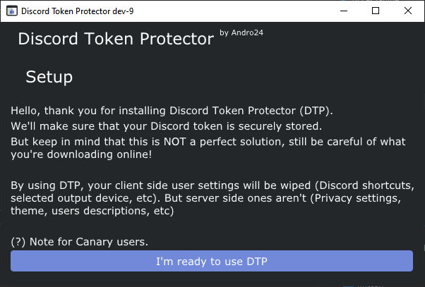
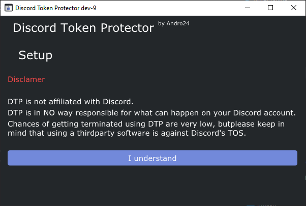
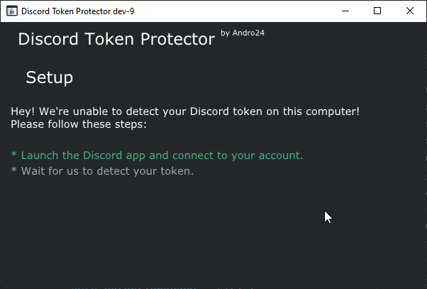
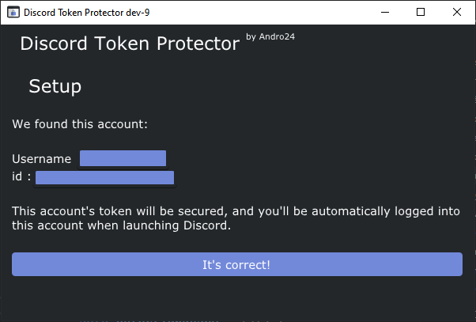

# Setup

### 1) When launching DiscordTokenProtector for the first time, you'll be greeted with these windows

  

  

*DiscordTokenProtector might not work correctly on Canary versions of Discord!*

### 2) Launch the Discord client with your account logged in

DiscordTokenProtector will automatically get the token from the Discord process.

  

### 3) Your account has been detected!

Once DiscordTokenProtector finds your token, it will automatically show you the username, the discriminator and the id of the account.
That way, you can easily tell if you're going to protect the right account.

*Right now DiscordTokenProtector doesn't support multiple accounts*

  

### 3) Creating the secure container

Then, you'll need to initialize a secure container that will store your Discord token.
You have 4 choices:
* The HWID encryption: it doesn't require any password, but any program running on your computer can also decrypt the container. **This is not a recommended mode**
* The password encryption: pretty self explainatory. The hash time corresponds to the time taken to hash your password.
The longer it is, the more time it will take to unlock the container. But it'll also make it more secure against bruteforcing.
* The password + HWID encryption: take the strength of the two first ones.
* YubiKey: if you have a YubiKey, you can use it to encrypt your token. Follow the guide [HERE](YubiSetup.md) to do it.

*Keep in mind that with the HWID ones, if you change your Windows user session (Windows reinstallation or New PC), you won't be able to unlock the secure container*

  

### 4) Done!

That's all! You can now use DiscordTokenProtector!
