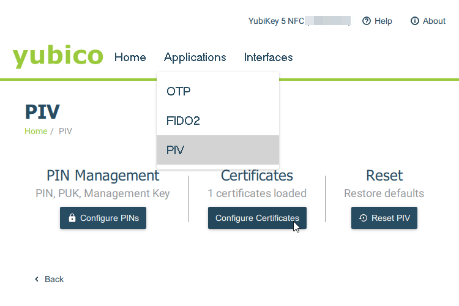
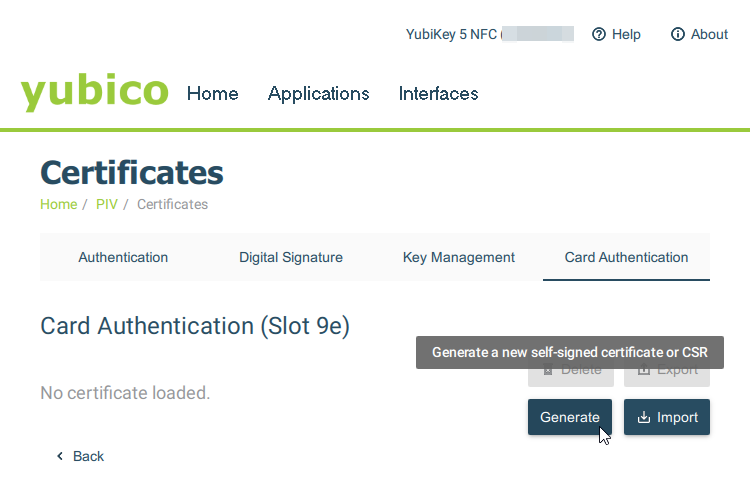
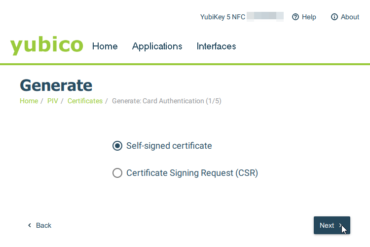
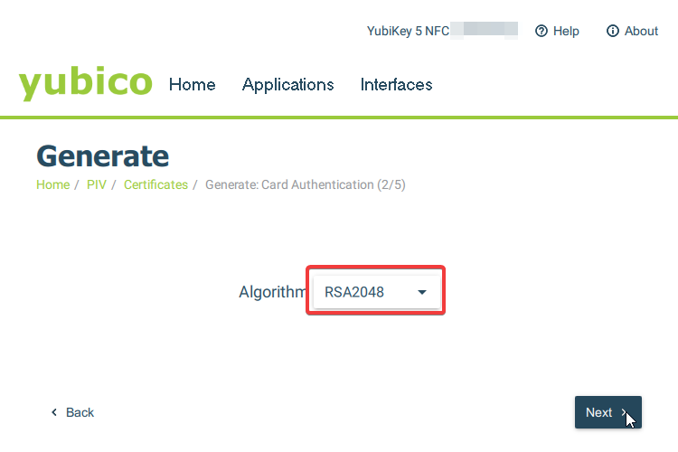
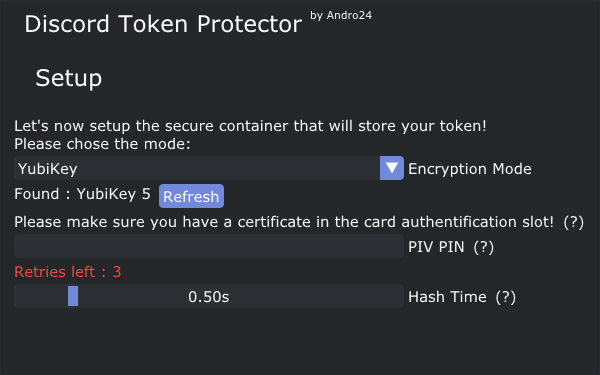

# YubiKey Setup

## If you already have a card authentification certificate skip to step 6

*Note: YubiKey NEO are not supported*

### 1) Install YubiKey Manager

Download it here : https://www.yubico.com/support/download/yubikey-manager/

### 2) Select "Configure Certificates"

  

### 3) Under "Card Authentification" click "Generate"

  

### 4) Select "Self-signed certificate"

  

### 4) Select "RSA2048" as the algorithm.

**This is important! Else, DTP won't be able to sign using the certificate.**

  

### 5) Generate!

For the subject name and the expiration date, it's up to you. These settings won't affect DTP.\

Note : the default PIN is 123456

### 5.5) Change the default PIN

This is pretty straight forward,
* Go the PIV menu
* Select `Configure PINs`
* Select `Change PIN`

*You should also change your PUK (used to unlock the key after you run out of retries)*

### 6) Select the "YubiKey" encryption mode in DTP

  

In the "PIV PIN" textbox, enter the PIN (123456 by default).\
Be careful, **you only got 3 trial attempts**! (After that, your key will be locked, and you'll have to unlock it with the PUK)

The "Hash Time" is the same as the one in "Password (+ HWID)" mode.